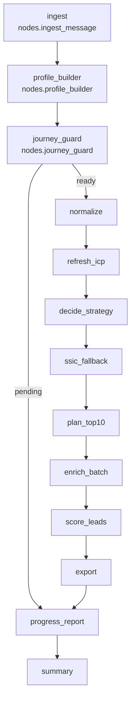

Agents Guide — lead_generation-main

## Frontend & Backend Agent Standards (LangChain + LangGraph + Codex)

This repository (frontend and backend orchestration alike) uses a multi-agent architecture powered by LangChain, LangGraph, and Codex. All agents must follow the common standards below to ensure reliable, safe, and maintainable behavior.

1. Architectural Philosophy  
   1.1 **Agentic Loop Standard** – User Input → LLM Intent Evaluation → Tool Selection → Tool Execution → Observe Result → Continue or Conclude.  
   - Prefer tools whenever possible, avoid hallucinating logic.  
   - Stop only when the LLM determines no more tool calls are needed.

2. Agent Roles & Responsibilities  
   - Supervisor Agent routes tasks, maintains workflow context, enforces gates, validates results, merges outputs, and asks clarifying questions.  
   - Five specialist agents: Architecture, Code Generation, Testing, Optimization, Documentation.  
     - **Architecture Agent** – system design, data modeling, APIs, scalability.  
     - **Code Generation Agent** – feature implementation, production-quality code, conventions.  
     - **Testing Agent** – unit/integration/E2E coverage, edge cases, CI recommendations.  
     - **Optimization Agent** – refactors, performance tuning, security review.  
     - **Documentation Agent** – docs/README/API references with consistent Markdown.  
   - Supervisor parses intent, selects the right specialist, passes relevant context only, validates specialist outputs, and aggregates responses.

3. Coding Standards for LLM-Generated Code  
   - Produce full runnable files with imports, dependencies, and usage guidance.  
   - Comment only non-trivial logic; follow PEP8/ESLint/Prettier as applicable.  
   - Avoid placeholders (`TODO`, `xxx`).  
   - Python: prefer Pydantic v2, async for network work, no globals.  
   - JS/TS: ES modules, TypeScript when possible, async/await, DRY patterns.

4. LangChain Agent Implementation Rules  
   - Every agent created via `langchain.agents.create_agent`.  
   - Tools decorated with `@tool`, typed args, deterministic behavior, clear docstrings.  
   - System prompts must define role, responsibilities, expected outputs, failure/safety rules.

5. LangGraph Rules  
   - Use LangGraph for routing, orchestration, persistence, HITL, long tasks.  
   - Graph state defined with `TypedDict`.  
   - Nodes must be idempotent.

6. Context Engineering Standards  
   - Agents extract language, framework, conventions, constraints, dependencies, environment from user context.  
   - Supervisor detects ambiguity, asks clarifying questions, avoids assumptions.

7. Tooling Standards  
   - Single-responsibility tools returning structured outputs (JSON or typed).  
   - Docstrings must explicitly say when to use the tool.

8. Multi-Agent Routing Rules  
   - Supervisor routing table:  
     - System design → Architecture Agent  
     - Generate/modify code → Code Generation Agent  
     - Bugs/errors → Testing Agent  
     - Performance/refactoring → Optimization Agent  
     - Documentation → Documentation Agent  
     - Ambiguous → ask clarifying question

9. Safety & Guardrails  
   - No fabricated packages/APIs/frameworks, no invalid syntax, no bare code execution.  
   - Supervisor pauses for confirmation on destructive actions, remote API calls, code deletion, schema migrations.

10. Folder Structure & Conventions  
   ```
   /agents
       supervisor.py
       architecture.py
       codegen.py
       testing.py
       optimization.py
       documentation.py

   /tools
       database.py
       email.py
       context.py
       quality.py

   /graphs
       router_graph.py
       workflow_graph.py

   /prompts
       supervisor_system.txt
       codegen_system.txt
       architecture_system.txt
       ...
   ```

11. Commit Rules for AI-Generated Code  
   - Every PR records which agent produced code, reasoning summary, tests, human-review checklist.

12. Supervisor Agent Selection Logic  
   - Always weighs user intent, desired output, necessary tools, specialist capabilities, conversation context.  
   - Example: “Optimize this function” → Optimization Agent.

13. Encouraged Patterns  
   - ReAct loop, Toolformer-style calls, LangGraph state machines, multi-agent DAG workflows, Supervisor + specialists, retrieval-augmented agents.

## Unified Orchestrator Flow (Code-Backed)

The production flow in `my_agent/agent.py` wires the LangGraph nodes defined in `my_agent/utils/nodes.py`. The graph below mirrors the exact code paths (including the conditional gate coming out of `journey_guard`):



### Conversational gating
1. **`ingest_message`** – normalizes each chat turn with an LLM, tags the intent (`run_enrichment`, `confirm_company`, `question`, etc.), stores the canonical text, and seeds `entry_context` (tenant, timestamps, tags).
2. **`profile_builder`** – keeps the authoritative `profile_state`: captures company website/name/summary, tracks whether ICP + micro ICP were confirmed, harvests up to 5 customer URLs from chat, and persists company/ICP snapshots through `_persist_company_profile_sync` / `_persist_icp_profile_sync` when confirmations land.
3. **`journey_guard`** – enforces prerequisites before any backend work. It requires: confirmed company profile (website present), confirmed ICP, five customer websites, discovery confirmation, and enrichment confirmation. When data is missing it pushes tailored prompts (requesting website, more customer URLs, or ICP confirmation). Once discovery search produces ≥1 candidate it formats the 50-row table, persists all candidate domains plus 10-row preview into `staging_global_companies` via `_persist_discovery_candidates`, and flips `awaiting_enrichment_confirmation=True`. Only when `company_ready`, `icp_ready`, `discovery_ready`, and `enrichment_ready` are true does the graph continue to `normalize`; otherwise the run branches to `progress_report`/`summary` with the outstanding prompt echoed back to the user.

### Discovery + enrichment backend
4. **`normalize`** – calls `src.icp.normalize_agent` to clean freshly ingested company rows (mirrors the legacy Pre-SDR normalization step). The result is stored on `state["normalize"]`.
5. **`refresh_icp`** – runs `src.icp.icp_refresh_agent` once enrichment is confirmed, yielding `discovery["candidate_ids"]` plus diagnostics. Offline mode seeds dummy IDs so downstream nodes still execute.
6. **`decide_strategy`** – lightweight LLM policy that chooses `use_cached`, `regenerate`, or `ssic_fallback` based on counts + last SSIC attempt; the choice is recorded on `discovery["strategy"]`.
7. **`ssic_fallback`** – always invoked (the graph edges force it) and, when industries exist, calls `src.icp.icp_by_ssic_agent` to backfill candidate IDs from ACRA/SSIC data.
8. **`plan_top10`** – runs `src.agents_icp.plan_top10_with_reasons` to rank the best candidates for enrichment. Results include rationales and timestamps.
9. **`enrich_batch`** – iterates through `discovery["candidate_ids"]` and calls `src.enrichment.enrich_company_with_tavily` (network I/O). Failures are captured per company so `score_leads` can still run.
10. **`score_leads`** – sync call into `src.lead_scoring.lead_scoring_agent` to convert enrichment outputs into lead scores + reasons, stored on `state["scoring"]`.
11. **`export_results`** – packages outcomes, queues Next-40 enrichment via `src.jobs.enqueue_web_discovery_bg_enrich` (using the tenant ID pulled from `entry_context`), and leaves an Odoo placeholder flag for future sync.
12. **`progress_report` / `summary`** – `progress_report` either replays the outstanding prompt from `journey_guard` or uses an LLM to summarize the status (including candidate totals). `summary` simply mirrors the latest status message and ends the run.

### Persistence & side effects
- Company/ICP confirmations auto-sync into Postgres (`app/pre_sdr_graph`) so manual re-entry isn’t needed.
- Discovered websites (preview 10 + remaining up to 50) are staged in `staging_global_companies` with metadata capturing bucket/score/reason, matching the behavior in `_persist_discovery_candidates`.
- Candidate IDs from `refresh_icp` / `ssic_fallback` are what drive enrichment, scoring, exporting, and the Next-40 enqueue—so skipping those nodes would orphan the downstream steps.

## Purpose
- Pre-SDR pipeline: normalize → ICP candidates → deterministic crawl + Tavily/Apify → ZeroBounce verify → scoring + rationale → export → optional Odoo sync.

Run API
- python -m venv .venv && source .venv/bin/activate
- pip install -r requirements.txt
- uvicorn app.main:app --host 0.0.0.0 --port 2024
- Endpoints: /export/latest_scores.csv, /docs

Run Orchestrator (one-off)
- source .venv/bin/activate
- python -m src.orchestrator

Key Env Vars (src/settings.py)
- POSTGRES_DSN (required)
- OPENAI_API_KEY, LANGCHAIN_MODEL=gpt-4o-mini, TEMPERATURE=0.3
- TAVILY_API_KEY?, ZEROBOUNCE_API_KEY?
- APIFY_TOKEN (required for Apify), ENABLE_APIFY_LINKEDIN=true
- Optional: APIFY_INPUT_JSON to pass a custom actor input JSON template.
  - Use placeholders: %%QUERY%% for a single query string, %%QUERIES%% for an array of queries.
- Optional: APIFY_SEARCH_ACTOR_ID for resolving LinkedIn profile URLs when the main actor requires `profileUrls`.
- Optional: APIFY_COMPANY_FINDER_BY_DOMAIN_ACTOR_ID for resolving a LinkedIn company URL from a website domain (Top‑10/Next‑40). Default: `s-r~free-linkedin-company-finder---linkedin-address-from-any-site`.
- Optional: APIFY_DEBUG_LOG_ITEMS=true to log a small sample of Apify dataset items and normalized contacts. Control size via APIFY_LOG_SAMPLE_SIZE (default 3).
- Optional: APIFY_USE_COMPANY_EMPLOYEE_CHAIN=true to use the chain company-by-name → employees → profile-details.
- APIFY_COMPANY_ACTOR_ID=harvestapi~linkedin-company, APIFY_EMPLOYEES_ACTOR_ID=harvestapi~linkedin-company-employees, APIFY_LINKEDIN_ACTOR_ID=dev_fusion~linkedin-profile-scraper
- ENABLE_LUSHA_FALLBACK=false (optional; set true only if you want Lusha as a fallback), LUSHA_API_KEY? (optional)
- ICP_RULE_NAME=default, CRAWL_MAX_PAGES=6, EXTRACT_CORPUS_CHAR_LIMIT=35000
- ODOO_POSTGRES_DSN (or resolve per-tenant via odoo_connections)

Migrations
- Apply multi-tenant + MV: app/migrations/004_multi_tenant_icp.sql
- Odoo columns: app/migrations/001_presdr_odoo.sql

Tenancy & Auth (Section 6)
- Production: Validate Nexius SSO JWT, set request.state.tenant_id and roles.
- Enforce RLS/filters on tenant-owned tables; set GUC request.tenant_id per request.
- Dev: X-Tenant-ID header may be accepted for local testing only.

Common Ops
- Refresh MV: REFRESH MATERIALIZED VIEW CONCURRENTLY icp_candidate_companies;
- Export shortlist: curl "http://localhost:2024/export/latest_scores.csv?limit=200" -o shortlist.csv
- Logs: tail -f .logs/*.log

Troubleshooting
- Postgres connect errors: verify POSTGRES_DSN and DB reachable.
- Tavily/Apify/ZeroBounce: missing keys → fallbacks/pathways skip gracefully; check settings flags.

Apify Usage
- Nightly ACRA/ACRA Direct: use existing Apify name→company→employees→profiles chain as before.
- Top‑10/Next‑40: domain is known from ICP; resolve LinkedIn company URL via `APIFY_COMPANY_FINDER_BY_DOMAIN_ACTOR_ID`, then employees→profiles with title filtering.

Scheduler & Cron
- Use the async scheduler entry: `python lead_generation-main/scripts/run_scheduler.py`
- Configure start time via `SCHED_START_CRON` (default `0 1 * * *` for 01:00 SGT)
- Limits & caps:
  - `SCHED_DAILY_CAP_PER_TENANT` (default 20 in .env)
  - `SCHED_COMPANY_BATCH_SIZE` (per-batch company count; default 1)
  - Vendor caps (coarse): `TAVILY_MAX_QUERIES`, `APIFY_DAILY_CAP`, `LUSHA_MAX_CONTACT_LOOKUPS` (only if Lusha fallback enabled)
  - ZeroBounce: `ZEROBOUNCE_MAX_VERIFICATIONS`, `ZEROBOUNCE_BATCH_SIZE`

Admin Kickoff Endpoint
- POST `/admin/runs/nightly` (requires admin role)
  - Run all tenants: `curl -X POST http://localhost:2024/admin/runs/nightly -b 'nx_access=...'`
  - Run a single tenant: `curl -X POST 'http://localhost:2024/admin/runs/nightly?tenant_id=123' -b 'nx_access=...'`
