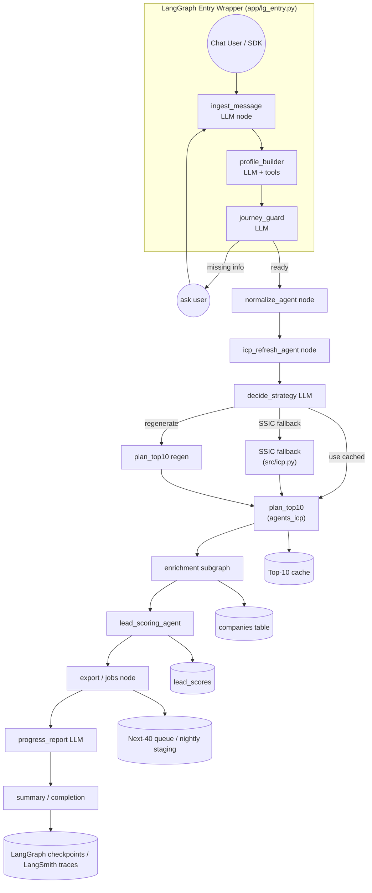

# Feature PRD: LangGraph Orchestrator with Subgraphs

## Problem

User journeys are split between the conversational Pre‑SDR graph (profile/ICP capture) and a separate batch script for backend work. This fragmentation causes duplicated logic, lost context between stages, and no single LangGraph view of the entire workflow.

## Goal

Deliver one LangGraph orchestrator that runs **all steps**—profile generation, ICP discovery, candidate planning, enrichment, scoring, and exports—while reusing existing subgraphs. The orchestrator must:

1. Serve as the single entry point for chat, API, or cron triggers.
2. Parse every user message, understand intent, and advance the journey without relying on a separate router.
3. Use LangGraph checkpoints/retries across all stages.
4. Embed LLM-driven nodes for intent detection, stage selection, discovery strategy, and progress reporting.
5. Produce unified instrumentation (LangSmith traces, callbacks) covering the full pipeline.

## Non-Goals

- Changing enrichment/lead scoring internals (they remain reusable subgraphs).
- Altering database schemas; existing tables/caches continue to store results.

## Alignment with Current Workflow

`Development_Plan/workflow.md` lists reusable modules that will be embedded into the single orchestrator:

| Component | How it’s reused |
| --- | --- |
| Entry wrapper (`app/lg_entry.py`) | Still normalizes SDK payloads, then invokes the orchestrator for every user turn. |
| Pre-SDR logic | Folded into orchestrator nodes (`ingest_message`, `profile_builder`, `journey_guard`, `candidate_preview`). |
| ICP utilities (`src/icp.py`) | Called from normalization/refresh/SSIC nodes. |
| ICP discovery agents (`src/agents_icp.py`) | Used in discovery planning (`plan_top10_with_reasons`). |
| Enrichment pipeline (`src/enrichment.py`) | Invoked per company during enrichment stage. |
| Lead scoring (`src/lead_scoring.py`) | Invoked during scoring stage. |
| Jobs / exports (`src/jobs.py`, `app/odoo_store.py`) | Reused in export node for Next‑40 queueing + Odoo sync. |

The standalone Pre‑SDR graph and imperative orchestrator will be retired once the new agent covers all stages.

## Architecture

### State

Define an `OrchestrationState` TypedDict capturing:

| Key | Description |
| --- | ----------- |
| `messages` | Conversation history (LangGraph messages channel). |
| `profile_state` | Company + ICP profile data, confirmations, micro-ICP selections, outstanding prompts. |
| `icp_payload` | Structured payload produced from `profile_state` for downstream steps. |
| `normalize` | Status/results from `normalize_agent`. |
| `candidate_ids` | IDs returned by `icp_refresh_agent` / SSIC fallback. |
| `top10` | Top-10 shortlist metadata/cache refs. |
| `enrichment_results` | Array of per-company enrichment snapshots. |
| `scoring` | Lead scoring outputs. |
| `exports` | Export status (Next-40 queue, Odoo sync). |
| `status` | Stage marker + timestamps + last progress report. |

### Subgraphs / Nodes

1. **`ingest_message` (LLM)** — normalizes incoming payloads, tags intent snippets, and appends to `messages`.
2. **`profile_builder` (LLM + tools)** — extracts/updates company + ICP profile fields, tracks confirmations, handles edits.
3. **`journey_guard` (LLM)** — determines whether prerequisites (profile locked, discovery approved, micro-ICP accepted) are satisfied. Emits follow-up prompts when data is missing.
4. **`normalize` node** — wraps `normalize_agent.ainvoke`.
5. **`refresh_icp` node** — wraps `icp_refresh_agent.ainvoke`.
6. **`ssic_fallback` node** — `_find_ssic_codes_by_terms` + `_select_acra_by_ssic_codes`.
7. **`plan_top10` node** — `agents_icp.plan_top10_with_reasons`.
8. **`enrich_batch` node** — invokes the enrichment subgraph per company.
9. **`score_leads` node** — runs `lead_scoring_agent`.
10. **`export` node** — handles Next-40 queue + Odoo sync.
11. **`summary` node** — produces final report, updates `status`.
12. **LLM planner/report nodes** — `decide_strategy` for discovery choices, `progress_report` for user-facing updates.

### End-to-End Control Flow

- Every node updates `state["status"]` so monitoring dashboards and the user-facing transcript know the active phase.
- `journey_guard` enforces prerequisites (profile lock, discovery approval, micro-ICP selection) and loops back to user prompts when needed.
- LLM decision nodes (`decide_strategy`, `progress_report`) evaluate pipeline state to pick cached vs. regenerate paths and emit user-facing updates.
- Checkpoints persist conversation + backend state, enabling pause/resume across the full journey.

### Detailed Process Flow

1. **Message ingestion** – `ingest_message` normalizes every payload (text, attachments), classifies intent, and appends the turn to `messages`.  
2. **Profile building / confirmation** – `profile_builder` extracts or edits company + ICP fields; `journey_guard` checks confirmations and outstanding prompts, emitting follow-up questions when prerequisites are missing.  
3. **Normalization & ICP refresh** – once `journey_guard` signals “ready,” the orchestrator runs `normalize_agent` and `icp_refresh_agent`, capturing counts/errors in `state`.  
4. **Discovery planning** – `decide_strategy` chooses cached vs. regenerated vs. SSIC fallback paths; `plan_top10_with_reasons` builds the shortlist and stores it in `top10`.  
5. **Enrichment & scoring** – `enrich_batch` invokes the enrichment graph per company, persisting results; `score_leads` runs the scoring graph and writes `lead_scores`.  
6. **Exports & reporting** – `export` enqueues Next‑40 jobs / Odoo sync; `progress_report` summarizes status for the UI; `summary` finalizes `status` and checkpoints.

### Example Conversations

| Scenario | Conversation snippet | Orchestrator response |
| --- | --- | --- |
| Customer list before website | User: “Here are my best customers: Contoso, Fabrikam…” → Agent: “Thanks! What’s your own website so I can summarize it?” | `journey_guard` sees `company_profile_confirmed=false`, loops back to `ingest_message` with a follow-up prompt instead of running normalization. |
| User ready to run pipeline | User: “Website is acme.sg. Confirm profile. Run enrichment.” | `journey_guard` flips prerequisites to true → orchestrator runs normalization, discovery, enrichment, scoring, export sequentially; `progress_report` streams updates until `summary` reports completion. |
| No candidates from ICP refresh | User: “Profiles locked. Run discovery.” (niche filters) | `icp_refresh_agent` returns 0 IDs → `decide_strategy` selects SSIC fallback → `ssic` node pulls codes, `plan_top10` regenerates shortlist before enrichment. |
| Long-running enrichment | User: “Finish pipeline for this shortlist.” | During `enrich_batch`, `progress_report` sends “X of Y companies enriched…” updates; on vendor cap errors it notifies the user and pauses until quota resets. |
| Export-only follow-up | User: “Export yesterday’s leads to Odoo.” | `journey_guard` detects enrichment already complete; orchestrator jumps directly to `export`, logs status, and confirms via `progress_report`. |

### Integration Points

| Caller | How it uses the orchestrator |
| ------ | --------------------------- |
| CLI / scheduler | `orchestrator_graph.invoke({"icp_payload": ...}, config)` replaces `python src/orchestrator.py`. |
| Chat UI | Entry wrapper invokes the orchestrator every turn; `ingest_message` / `journey_guard` handle the conversational experience inside the graph itself. |
| APIs (`app/icp_endpoints.py`) | Expose `/orchestrations/run-now` that forwards to the orchestrator graph for headless triggers. |
| Observability (LangSmith / log service) | Register callbacks so orchestrator runs appear alongside conversational traces, keeping the workflow diagram’s monitoring layer consistent. |

## Milestones

1. **Graph scaffolding** — Define `OrchestrationState`, implement conversation + backend nodes, compile with LangGraph persistence.
2. **Subgraph wiring** — Integrate `normalize_agent`, `icp_refresh_agent`, `plan_top10_with_reasons`, enrichment, lead scoring, and export helpers.
3. **LLM prompt implementation** — Finalize prompts for `ingest_message`, `profile_builder`, `journey_guard`, `decide_strategy`, `progress_report`.
4. **CLI / scheduler adapter** — Replace `src/orchestrator.py` with a thin wrapper that invokes the new graph.
5. **UI hook-up** — Point the entry wrapper to the new orchestrator so every user turn flows through the single graph.
6. **Observability** — Register callbacks (LangGraphTroubleshootHandler, LangSmith) and configure metrics.

## Risks / Mitigations

- **Long-running nodes**: Enrichment loops may exceed worker timeouts. Mitigate by chunking candidates, checkpointing after each company, and enabling resume.
- **State schema drift**: Ensure subgraphs share typed state slices or use transformation nodes when invoking graphs with different schemas.
- **Resource contention**: Running enrichment inside the orchestrator must respect vendor caps (Apify, Lusha). Reuse the rate-limit helpers from `src/enrichment`.

## Success Criteria

- Batch jobs (manual or scheduled) run entirely through the LangGraph orchestrator.
- LangGraph checkpointers show end-to-end state transitions for each orchestration thread.
- Chat users can trigger the orchestrator (or at least see results generated by it) without code duplication.
- Ops gains: easier debugging (LangSmith traces), consistent logging, and shared retry logic across conversational + batch workflows.
