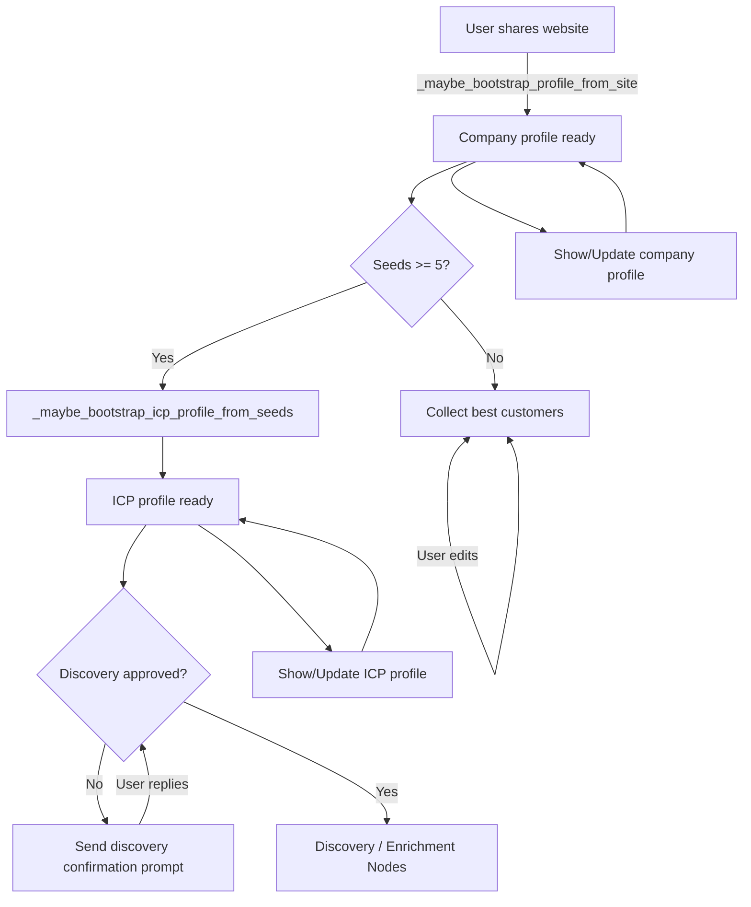

# Simplified ICP Intake Flow

This document captures the planned refactor that removes the legacy confirmation gates and aligns the LangGraph workflow with the new, linear guardrails.

## Required Changes

1. **Prune the company/ICP confirmation gates**
   - Delete `_handle_profile_confirmation_gate`, `_handle_icp_profile_confirmation_gate`, and every `awaiting_*` flag.
   - Keep `_prompt_profile_confirmation` / `_prompt_icp_profile_confirmation`, but use them purely as snapshot-sharing helpers—never as blocking prompts.
2. **Redefine the workflow status tuple**
   - Update `ProfileWorkflowStatus` (`app/pre_sdr_graph.py`) to expose only `company_ready`, `icp_ready`, and `discovery_ready`.
   - `company_ready` flips to `True` immediately after `_maybe_bootstrap_profile_from_site` produces a non-empty `company_profile`.
   - `icp_ready` flips to `True` once `_maybe_bootstrap_icp_profile_from_seeds` (or the Finder agent) writes an `icp_profile`.
   - `discovery_ready` becomes `company_ready and icp_ready and icp_discovery_confirmed`.
3. **Simplify router gating**
   - In `router_entry`, route to `cpgen` whenever no company profile exists.
   - Route to `icpgen` while the company profile exists but the ICP profile does not.
   - Only intercept “run discovery”/“run enrichment” commands when `discovery_ready` is `False`; all other user turns continue through the normal nodes.
4. **Preserve interactive controls**
   - Keep `_is_profile_show_request` and `_is_profile_update_request` pathways so users can ask “show company profile”, “show ICP profile”, or push edits at any time.
   - Snapshot helpers should always respond, even mid-flow, without re-opening any gates.
5. **Final approval prompt**
   - Reuse `icp_discovery_prompt_node` as the single gate once both profiles exist.
   - Accept “confirm discovery”, “looks good”, or “run discovery” as approval and set `icp_discovery_confirmed=True`.
   - If the user’s reply is unrelated, answer normally but keep the flag `False` until they explicitly approve.

## Updated Intake / Profile Flow

| Stage | Trigger | State Outputs | Notes |
| ----- | ------- | ------------- | ----- |
| **Website ingestion** | User shares a website or the graph infers it from CRM context. | `company_profile` populated via `_maybe_bootstrap_profile_from_site`; `company_ready=True`. | Any subsequent “show company profile” command sends the latest snapshot. |
| **Seed capture** | User lists best customer URLs. | Seeds live inside `state["icp"]["seeds_list"]`; no gate is tied to a count, but `_maybe_bootstrap_icp_profile_from_seeds` only runs once ≥5 normalized seeds exist. | Users can continue editing seeds without affecting `company_ready`. |
| **ICP synthesis** | After ≥5 seeds (or finder defaults) exist. | `icp_profile` populated; `icp_ready=True`. | Users can run “show icp profile” or push updates anytime. |
| **Discovery approval** | Both profiles exist. | Agent emits the discovery confirmation prompt; `discovery_ready=False` until the user approves. | Only enrichment/discovery commands are blocked; all other questions go through. |
| **Discovery / enrichment** | User approves (“confirm discovery”, “run discovery”). | `icp_discovery_confirmed=True`, `discovery_ready=True`. | Router now allows candidates, scoring, and enrichment nodes to run. |

## ICP Intake Process Flow

1. **Listen for website input**
   - Parse each human message for a domain (`_parse_website`).
   - If found, normalize, persist, kick `_maybe_bootstrap_profile_from_site`, and send the snapshot to the user.
2. **Collect best customers**
   - Parse multi-line replies via `_parse_seeds`; normalize with `_normalize_seed_entries`.
   - Keep reusing `state["icp"]["seeds_list"]` so edits overwrite previous seeds; no confirmation loop required.
3. **Synthesize company profile**
   - The site bootstrapper (Jina snapshot + heuristics) writes industries, buyer titles, etc.
   - Immediately call `_prompt_profile_confirmation` (with `require_confirmation=False`) so the user sees the summary but the router keeps moving.
4. **Synthesize ICP profile**
   - Once ≥5 seeds are available, run `_maybe_bootstrap_icp_profile_from_seeds`.
   - Share the snapshot via `_prompt_icp_profile_confirmation(require_confirmation=False)` and set `icp_ready=True`.
5. **Discovery approval**
   - Emit the confirmation prompt after both profiles exist.
   - Accept “confirm discovery”, “go ahead”, “run discovery”, etc., as approval.
6. **Candidate generation → scoring → enrichment**
   - Behave as today once `discovery_ready=True`.

## Mermaid Flow

This diagram highlights that only three gates remain:

1. **Company profile ready** (website captured & processed)
2. **ICP profile ready** (enough seeds to synthesize)
3. **Discovery approved** (explicit opt-in before heavy actions)

All other interactions—showing snapshots, editing inputs, asking questions—are always available so users can interrupt the flow without getting trapped in confirmation loops.

## Example Conversations

Use these transcripts to validate each condition in the simplified flow:

1. **Website ingestion & snapshot**
   - User: “Start lead gen.”
   - Assistant: “What’s your website so I can summarize the company profile?”
   - User: “https://acmeautomation.com”
   - Assistant: “Reviewing acmeautomation.com now… (shares snapshot; no confirmation request).”
2. **Show / update company profile**
   - User: “Show company profile.”
   - Assistant: “Here’s the latest snapshot…”
   - User: “Add that we’re in healthcare automation.”
   - Assistant: “Updated industries; here’s the refreshed snapshot.”
3. **Seed capture before ≥5**
   - Assistant: “List 5–15 of your best customers (Company — website).”
   - User: “Contoso — https://contoso.com; Fabrikam — https://fabrikam.com.”
   - Assistant: “Thanks, I still need three more.”
   - User: “Northwind — https://northwind.com; Globex — https://globex.com; Initech — https://initech.com.”
   - Assistant: “Great, captured five seeds.”
4. **ICP synthesis + interruptions**
   - Assistant: “I synthesized the ICP profile from those customers—here’s the snapshot.”
   - User: “Show ICP profile.”
   - Assistant: “(Replays the snapshot.)”
   - User: “Replace buyer titles with ‘VP Operations, Head of Fulfillment’.”
   - Assistant: “Done—here’s the updated ICP snapshot.”
5. **Discovery approval gate**
   - Assistant: “Ready for discovery: confirm everything looks good and say ‘confirm discovery’ when you’re ready.”
   - User: “Run discovery.”
   - Assistant: “Before I do, please confirm discovery.”
   - User: “Looks good—confirm discovery.”
   - Assistant: “Confirmed! I can now run discovery/enrichment.”
6. **Post-approval actions**
   - User: “Run discovery.”
   - Assistant: “Running discovery with this ICP…”
   - User: “Show company profile again.”
   - Assistant: “Here’s the current snapshot…”
7. **Editing after approval**
   - User: “Update ICP industries to include logistics tech.”
   - Assistant: “Applied the change; here’s the refreshed ICP profile. Discovery remains approved.”
8. **Website change resets approval**
   - User: “Use https://acmeautomation.ai instead.”
   - Assistant: “Rebuilding the company profile for acmeautomation.ai (shares snapshot). ICP will refresh and I’ll ask for discovery approval again once ready.”
9. **Partial seed drop reminder**
   - User: “Customers: only 3 entries…”
   - Assistant: “Need two more; please add them.” (No blocking loop.)

Covering these scenarios ensures every branch—site capture, seed capture, profile show/edit, discovery approval, and reset behavior—is exercised.
