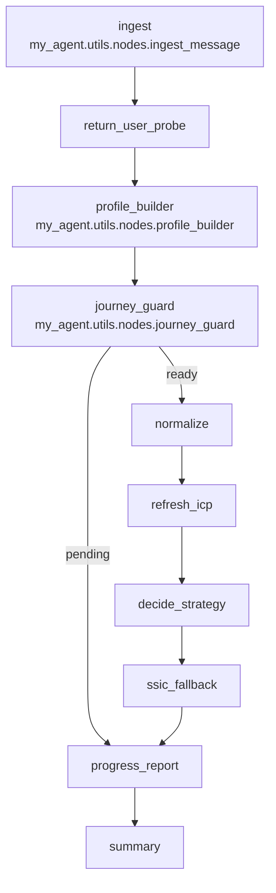

# Development Plan — Return User Thread Management & Decisions

This plan translates the “Return User Logic and Thread Management” feature PRD into concrete implementation steps across the orchestrator, API, and configuration, aligned to the existing codebase. It includes the full end-to-end user journey, the updated LangGraph architecture, and production‑ready LLM prompts.

## Goals & Non‑Goals
- Goals:
  - Add a `return_user_probe` node to reuse prior company/ICP data, minimize re‑asks, and compute when to use cached candidates vs re‑run discovery.
  - Enforce single active thread per ICP context; prior threads auto‑lock; history remains readable.
  - Auto‑resume an eligible open thread or ask the user to choose when ambiguous.
  - Extend `journey_guard` to honor `use_cached` vs `rerun_icp` and to keep chat prompts minimal.
- Non‑Goals:
  - Building a bespoke threads DB (use embedded server + durable checkpointer).
  - Cross‑agent thread merging (may be considered later).
  - Changes to nightly scheduler/ACRA flows beyond respecting new decisions.

## End‑to‑End User Journey (Updated)

The chat orchestrator no longer performs ICP discovery/enrichment inline. Its job is to collect confirmations (company + ICP), then queue a background job that does discovery → enrichment → scoring → email → Odoo export. The chat run only reports status/progress and next steps.

1) New User
- UI: Start chat without `thread_id`.
- Server: Creates an `open` thread with computed `context_key`.
- Graph: `return_user_probe` finds no snapshots → `profile_builder` asks for website and 5 customer URLs → `journey_guard` prompts step‑by‑step until ready → queues unified background job → `progress_report` → `summary`.

2) Returning User (Single Eligible → Auto‑resume)
- UI: No `thread_id` provided.
- Server: Finds exactly one eligible open thread for `(tenant_id, user_id, agent, context_key)` within `THREAD_RESUME_WINDOW_DAYS`; resumes it.
- Graph: `return_user_probe` loads persisted company/ICP; sets confirmations; computes `decisions`. When ready, `journey_guard` queues the background job; no inline discovery/enrichment.

3) Returning User (Multiple Eligible → Disambiguate)
- Server: Returns an assistant message listing ~2–3 threads (label by website/rule); user picks one.
- Server resumes the chosen thread; Graph continues as in (2).

4) New Thread for Same Context (Auto‑lock older)
- UI: “Start fresh”/“New ICP session”.
- Server: Creates a new `open` thread with same `context_key`, locks prior open threads, optionally auto‑archives stale locked threads.
- Graph: Seeds from snapshots and proceeds as in (2), queuing a background job when ready.

5) Context Change Mid‑Thread
- Graph: `return_user_probe` detects website/ICP drift; prompts: “Website/ICP changed — continue here and re‑run in background, or start a new session?”.
- User choice:
  - Continue: re‑queue background job; stay in thread.
  - New: lock current thread, open a new one with updated `context_key` and queue background job when ready.

6) Post‑Run Completion
- Background job finishes discovery + enrichment + scoring, emails results, and exports to Odoo. Chat status can be queried or is summarized when the user returns.

7) Read‑Only Locked Threads
- Attempting to send into a locked thread returns 409 (`thread_locked`).
- UI shows a “Read‑only” badge and disables composer with an affordance to start a new thread.

## Updated LangGraph Architecture

Mermaid diagram reflects the exact node order and gates (adds `return_user_probe`, extends the execution leg to Top‑10/Enrichment/Scoring/Export when policy allows):



Notes:
- The chat graph collects/normalizes inputs and decides strategy, but does not run discovery/enrichment inline anymore. `journey_guard` is responsible for queuing the background job and informing the user.

State (TypedDict additions):
- `tenant_id: int | None`, `thread_id: str | None`
- `is_return_user: bool`
- `decisions: { use_cached: bool, rerun_icp: bool, reason: str, stale_signals?: object, diffs?: object }`

Thread metadata (embedded server):
- `tenant_id`, `user_id`, `agent='icp_finder'`, `context_key`, `status: 'open'|'locked'|'archived'`, `locked_at`, `archived_at`, `reason`.
- `context_key` policy: `domain:<company_domain>` else `icp:<rule_name>#<payload_hash>`.

## LLM Prompts

1) Return User Probe (decision + rationale)
```
System:
You are a cautious orchestrator policy assistant. Decide whether to reuse cached ICP discovery results or re-run discovery.
Return ONLY compact JSON with keys: is_return_user (bool), use_cached (bool), rerun_icp (bool), reason (string <=120 chars),
stale_signals (object), diffs (object).

User:
Latest profiles and facts:
company_profile: {company_profile}
icp_profile: {icp_profile}
cached_discovery: {{ count: {candidate_count}, top10_age_days: {top10_age_days}, last_run_at: {last_run_at} }}
rules: {{ icp_rule_name: {icp_rule_name}, profile_staleness_days: {PROFILE_STALENESS_DAYS}, discovery_staleness_days: {DISCOVERY_STALENESS_DAYS} }}
incoming_intent: {intent}
incoming_text: {text}

Heuristics:
- use_cached when: candidates exist, last Top‑10 run is fresh (<= discovery_staleness_days), and no breaking diffs (website/industry/rule).
- rerun_icp when: website or industries changed, rule drift (icp_rule_name differs), or stale (> discovery_staleness_days).
Respond with JSON only.
```

2) Thread Disambiguation Prompt (assistant content to user)
```
System:
You help users resume the right session. If multiple threads are eligible, list 2–3 options with clear labels.

User:
Eligible threads (JSON): {threads: [{{id, updated_at, label, preview}} ...]}
Compose a one-paragraph message asking them to choose by label or number.
Include the labels and last updated timestamps. Do not include JSON in the reply.
```

3) Rerun Confirmation Prompt (assistant content to user)
```
System:
Explain why a re-run is recommended. Keep it brief and actionable.

User:
reason: {reason}
Say: “Re-run discovery now due to {reason}? (yes/no)”.
```

## Implementation Plan

1) Graph wiring
- File: `my_agent/agent.py`
  - Add `return_user_probe` node and wire edges: `ingest -> return_user_probe -> profile_builder`.
  - Keep the simplified linear leg after `ssic_fallback` that routes to `progress_report -> summary` (no inline Top‑10/enrich/score/export in chat graph).
  - Swap `MemorySaver` for a durable checkpointer when the embedded server is enabled (see API section).

2) State extensions
- File: `my_agent/utils/state.py`
  - Add optional fields on `OrchestrationState`: `tenant_id`, `thread_id`, `is_return_user`, `decisions`.
  - Keep backwards compatibility (total=False) and default initializers in nodes.

3) New node: `return_user_probe`
- File: `my_agent/utils/nodes.py`
  - Implement `return_user_probe(state)`:
    - Read `tenant_id`, `thread_id`, `entry_context` (intent/text) and, when available, LangGraph metadata via `langgraph_api.metadata.get_current_metadata()` to pick up `X-Tenant-ID` or thread metadata.
    - Load latest confirmed company/ICP snapshots for tenant via existing helpers in `app.pre_sdr_graph` or local DB queries.
    - Compute `context_key` and detect diffs vs state (website/industries/rule). Compute staleness by `PROFILE_STALENESS_DAYS`/`DISCOVERY_STALENESS_DAYS`.
    - Decide `use_cached` vs `rerun_icp` using the LLM prompt above with a safe fallback to heuristics.
    - Set `state["profile_state"]` confirmations accordingly and seed `state["discovery"]` with cached Top‑10 details when reusing.
    - Persist any discovered domains using `_persist_discovery_candidates` when appropriate.
    - Set `state["decisions"]` and `state["is_return_user"]`.

4) Respect decisions in `journey_guard`
- File: `my_agent/utils/nodes.py`
  - When company + ICP are confirmed, queue `enqueue_icp_discovery_enrich(tenant_id, notify_email)` and post the status message; do not run discovery/enrichment inline.
  - If cached reuse is signaled, proceed to queueing with a “reuse cache” status (still handled by the background worker).
  - If re‑run is signaled, ask for confirmation and then queue the background job upon “yes”. Otherwise hold at `progress_report`.

5) Embedded LangGraph Server
- File: `app/main.py`
  - Mount embedded LangGraph server when `ENABLE_EMBEDDED_LG_SERVER=true`:
    - Register graph id `orchestrator` by invoking `build_orchestrator_graph()` with a durable checkpointer (filesystem path from `LANGGRAPH_CHECKPOINT_DIR`, default `.langgraph_api`).
    - Expose routes: `/threads`, `/threads/{id}`, `/threads/{id}/runs`, `/threads/search`, `/runs/stream`.
    - Enforce auth via `app/lg_auth.py` and propagate `tenant_id` into thread metadata.
  - Preserve existing `/api/orchestrations` endpoints for backward compatibility and testing.

6) Thread Policy Hooks
- File: `app/main.py` (embedded server bootstrap) or a small `app/threads.py` helper
  - On thread create: compute `context_key` from latest known website or ICP payload; set metadata; lock other open threads for the same `(tenant_id,user_id,agent,context_key)` by updating their status.
  - On run start: reject runs to non‑`open` threads with 409 `{error: 'thread_locked', hint: 'create_new'}`.
  - Optional: auto‑archive stale locked threads when `AUTO_ARCHIVE_STALE_LOCKED=true` and older than `THREAD_STALE_DAYS`.

7) Configuration
- File: `src/settings.py`
  - Add:
    - `SINGLE_THREAD_PER_CONTEXT=true`
    - `THREAD_RESUME_WINDOW_DAYS=7`
    - `THREAD_STALE_DAYS=30`
    - `AUTO_ARCHIVE_STALE_LOCKED=true`
    - `PROFILE_STALENESS_DAYS=14`, `DISCOVERY_STALENESS_DAYS=14`
    - `ENABLE_EMBEDDED_LG_SERVER=true|false`
    - `LANGGRAPH_CHECKPOINT_DIR=.langgraph_api` (default)

8) Observability
- Files: `app/langgraph_logging.py`, `app/main.py`
  - Keep `LangGraphTroubleshootHandler` callbacks on orchestrator invocations.
  - Add structured logs for: thread create, auto‑lock/auto‑archive, probe decisions, rerun confirmations, cached reuse.

9) Tests
- Unit: `tests/test_return_user_probe.py` (decision matrix, context key hashing, staleness/website/industry drift).
- Integration: `tests/test_thread_policies.py` (auto‑resume single; disambiguation prompt; lock on new thread; locked threads return 409).
- API: extend `tests/test_orchestrator_api.py` to validate decisions flow and checkpoint persistence; add GET `/api/orchestrations/{thread_id}` asserts for new state fields.

## Data & Persistence
- Profiles: reuse existing persistence in `app/pre_sdr_graph` (`_persist_company_profile_sync`, `_persist_icp_profile_sync`).
- Discovery: reuse `_persist_discovery_candidates` to stage discovered domains (preview+bulk) under tenant.
- Threads: rely on embedded server’s durable checkpointer (filesystem or DB) for thread metadata and checkpoints.

## Acceptance Criteria (traceable)
- Auto‑resume: Starting without `thread_id` auto‑resumes exactly one eligible thread; else prompts user to pick; else creates new.
- Single active per context: Creating a new thread with same `context_key` locks prior open threads; locked threads reject runs (409); UI shows read‑only badge.
- Decisions respected: `use_cached` skips refresh and uses cached Top‑10; `rerun_icp` requires confirmation and refreshes on accept.
- No duplicate background jobs for identical `icp_hash + rule_name`.
- Tenant isolation enforced for profile loads and thread policies.

## Risks & Mitigations
- Ambiguous context keys: include domain + rule hash; always prompt when >1 eligible thread.
- Mid‑run locking: perform lock at thread create boundary; if a run is in progress, defer lock until completion.
- Long‑term thread proliferation: auto‑archive stale locked threads; UI hides archived by default.
- DB coupling: keep reads via existing helpers where possible; isolate any direct SQL to the `nodes.py` helpers.

## Rollout Plan
- Phase 1: implement `return_user_probe` + `journey_guard` decisions; auto‑resume/locking hooks; UI read‑only affordances; embed server behind env flag.
- Phase 2: enable `ENABLE_EMBEDDED_LG_SERVER` in staging; verify end‑to‑end; enable caching path for Top‑10 reuse.
- Phase 3: production enable; monitor thread counts, rerun ratios, and user friction; tune staleness thresholds.

## Open Questions
- Do we always lock prior open threads or only when “Start fresh” is explicit? (Default: always lock on new thread with same context.)
- Should `context_key` include a micro‑ICP selection hash? (Recommended: yes, when present.)
- Are we exposing a thread search UI or keeping server‑side disambiguation via assistant message only? (Default: assistant message.)

## Definition of Done
- New node is wired; state fields present; decisions honored by `journey_guard`.
- Embedded server routes available behind `ENABLE_EMBEDDED_LG_SERVER`; durable checkpoints persist across restarts.
- Tests pass: unit, integration, and API; orchestrator regression unaffected for `/export/latest_scores.csv` & scheduler.
- Documentation: this plan committed; updated API runbook for embedded server routes and thread policy.

## Code Cleanup & Setup

The orchestrator now defers all heavy work (ICP discovery + enrichment + scoring + email + Odoo) to background runners. Clean up the chat code paths and configuration accordingly:

- Disable/remove inline Top‑10/enrichment paths in chat
  - `my_agent/agent.py`: keep the simplified wiring (no `plan_top10`, `enrich_batch`, `score_leads`, `export_results`).
  - `my_agent/utils/nodes.py`: mark `plan_top10`, `enrich_batch`, `score_leads`, and `export_results` as deprecated for chat; retain only if needed by legacy flows/tests, otherwise move to a legacy module.
  - Remove unused imports (e.g., `enrich_company_with_tavily`, `plan_top10_with_reasons`) if no longer referenced after deprecation.

- Ensure background job path is the only execution route
  - `journey_guard`: always queue the unified background job once `company_profile_confirmed` and `icp_profile_confirmed` are true; do not attempt inline enrich.
  - Respect `UI_ENQUEUE_JOBS` for UI-triggered queue events; otherwise call `enqueue_icp_discovery_enrich` directly.

- Configuration defaults (src/settings.py)
  - `BG_DISCOVERY_AND_ENRICH=true` — enable background route in chat.
  - `CHAT_DISCOVERY_ENABLED=false` — feature flag to prevent accidental inline discovery.
  - `ENABLE_AGENT_DISCOVERY` as needed for any agentic planning, but keep heavy work out of the chat graph.
  - `UI_ENQUEUE_JOBS=true` in environments where the UI should handle queue events.

- Docs & UX
  - Make it explicit in the chat prompts that results will be emailed and Odoo will be updated when the job completes.
  - Provide a “status” intent (or command) that summarizes background job progress in chat.

- Tests
  - Remove or skip inline Top‑10/enrich/score tests for chat runs; add tests that verify job enqueue and status messages.
  - Keep background worker tests for discovery/enrichment/scoring/email/Odoo order intact.

- Observability
  - Ensure structured logs confirm: enqueue → job_start → scoring → email → Odoo export → job_complete in background workers.
  - Keep chat logs minimal (queued message + status updates).
