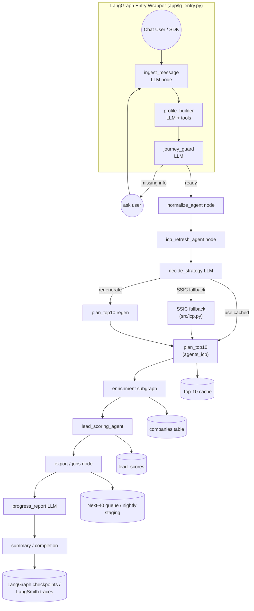

# LangGraph Workflow

## Overview

The stack now relies on a **single LangGraph orchestrator** (see `my_agent/agent.py`) that owns the full journey:

- **Entry wrapper (`app/lg_entry.py`)** — forwards every SDK turn directly into the orchestrator graph, carrying thread/tenant metadata.
- **Orchestrator graph (my_agent)** — handles conversation ingestion, profile building, prerequisite gating, normalization/ICP refresh, SSIC fallback, Top‑10 planning, enrichment, scoring, export, and progress reporting.
- **Reusable subgraphs** — existing LangGraph agents (`normalize_agent`, `icp_refresh_agent`, `agents_icp.plan_top10_with_reasons`, `enrichment_agent`, `lead_scoring_agent`) plug into orchestrator nodes, so backend behavior matches the legacy Pre‑SDR flow.
- **API endpoints (`/api/orchestrations`)** — the FastAPI server exposes REST entry points to trigger/check runs with tracing + metrics (LangGraphTroubleshootHandler, LangSmith).

## End-to-End Flow (Mermaid)

Copy/paste the snippet into any Mermaid renderer (e.g., VS Code preview or the LangGraph `draw_mermaid` helper) to visualize the entire system.

### API Endpoints

- **POST `/api/orchestrations`** — trigger or resume a run; request body mirrors the chat payload (`input`, `messages`, optional `thread_id`). Response includes `thread_id`, `status`, `status_history`, and `status["message"]`.
- **GET `/api/orchestrations/{thread_id}`** — fetch the latest checkpoint/state for a thread (used by CLI/cron/ops dashboards). Response mirrors the POST output plus the full LangGraph state blob.

Both endpoints attach LangGraph troubleshooting callbacks and emit structured metrics (`log_json`) so each run is traceable alongside LangSmith traces.

### Offline / Local Testing

- Set `ORCHESTRATOR_OFFLINE=1` before invoking `scripts/run_orchestrator.py` to stub external dependencies (Postgres, MCP, vendor APIs). The graph still walks every stage and emits realistic status history for UI testing.
- Reset the variable (or set to `0`) to run against real infrastructure.

### Chat UI Integration

- `agent-chat-ui/src/providers/ChatProgress.tsx` subscribes to chat SSE events **and** polls `/api/orchestrations/{thread_id}` via `useAuthFetch`, injecting every `status_history` entry into the progress feed.
- Users now see backend stage updates (normalize, refresh_icp, plan_top10, enrich_batch, etc.) inline with LangGraph messages, even when SSE is unavailable.
